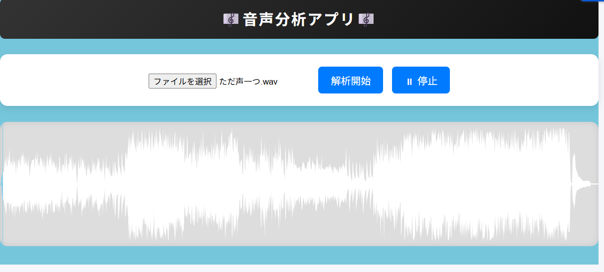

# 🎧 音声解析アプリ

## 概要
音声ファイルをアップロードすると、音響情報を解析して数値データとして可視化するWebアプリです。  
フロントエンドとバックエンドをAPI通信で分離し、ブラウザから送信した音声をPythonで解析し結果を返す構成で実装しました。

---

## デモ / Preview
音声ファイルをアップロードし、波形表示と解析結果を取得できます。

---

## 主な機能
- 音声ファイルアップロード
- 波形表示（WaveSurfer.js）
- 解析API呼び出し
- 解析結果表示

---

## 解析項目
本アプリでは以下の音響指標を算出します。

- BPM（テンポ推定）
- 再生時間
- サンプルレート
- ピーク数（音量ピーク検出）
- 最小振幅
- 最大振幅
- 平均振幅

---

## 使用技術

### Frontend
- HTML
- CSS
- JavaScript
- WaveSurfer.js

### Backend
- Python
- FastAPI（APIRouter構成）

---

## 設計上の工夫
- フロント → API → 解析 → JSON返却 の責務分離構成
- FastAPI Router分割により拡張しやすい設計
- API処理中のローディング表示でUXを改善

---

## 技術的に苦労した点
- 音声バイナリデータの送受信処理
- 一時ファイル生成と解析処理の連携
- フロント⇄バック間のデータ整合性制御

---

## 今後の改善予定
- mp3 / aac 等フォーマット対応
- 解析精度の向上
- 非同期処理による高速化
- より音楽的価値の高い解析指標の追加（キー推定・セクション検出等）

---